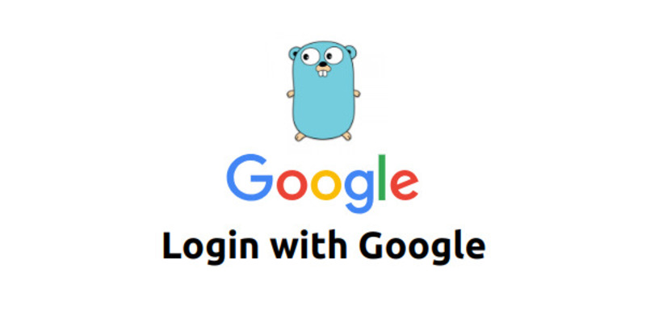
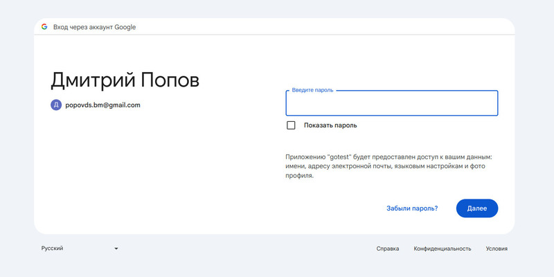
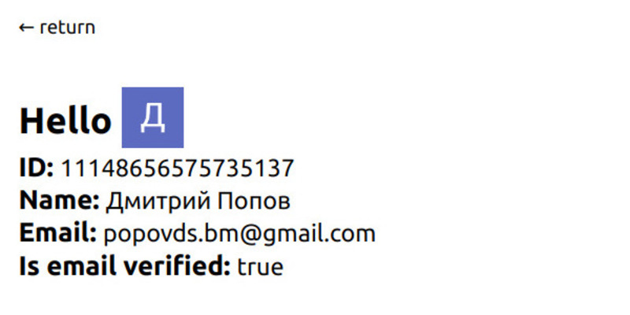

#### About

Приложение, которое позволяет пройти аутентификацию через Google OAuth и получить информацию о данных пользователя

#### How to run

1. Зарегистрироваться в https://console.cloud.google.com
2. Зарегистрировать рабочий проект, получить для него Client ID и Client secret
3. Использовать Client ID и Client secret в .env файле
4. Запустить make команды:
   - make getdeps
   - make build
   - make start
5. Приложение доступно на порте 8000

#### Screenshots

